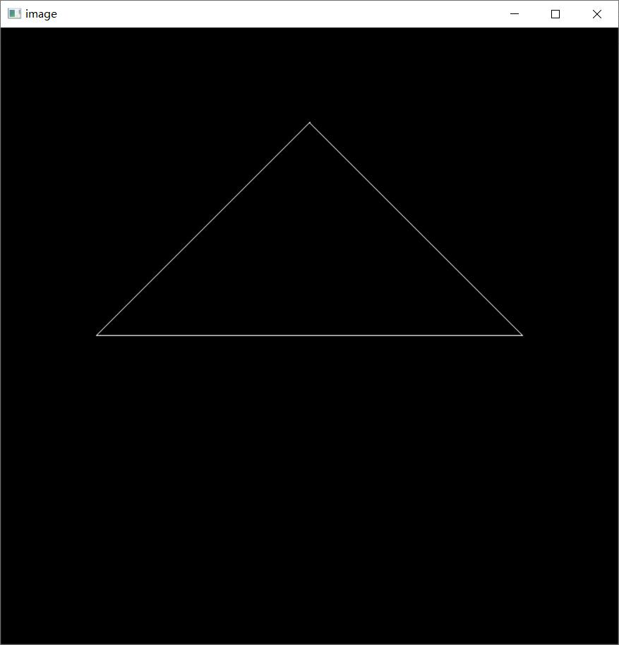
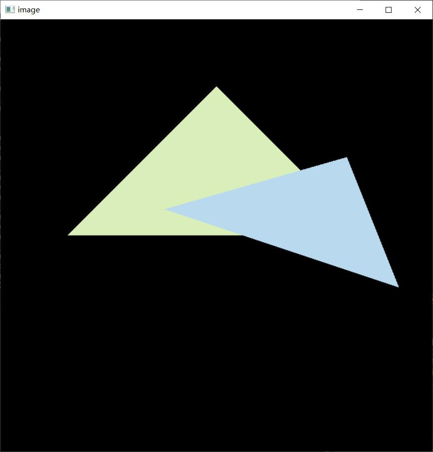
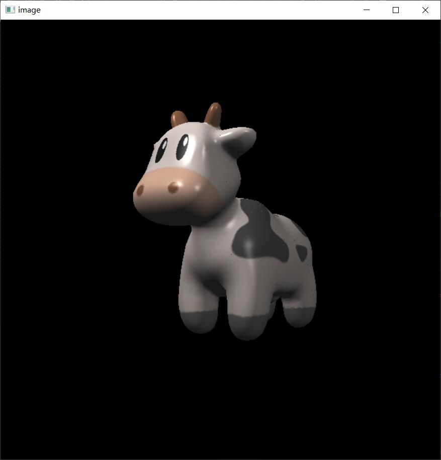
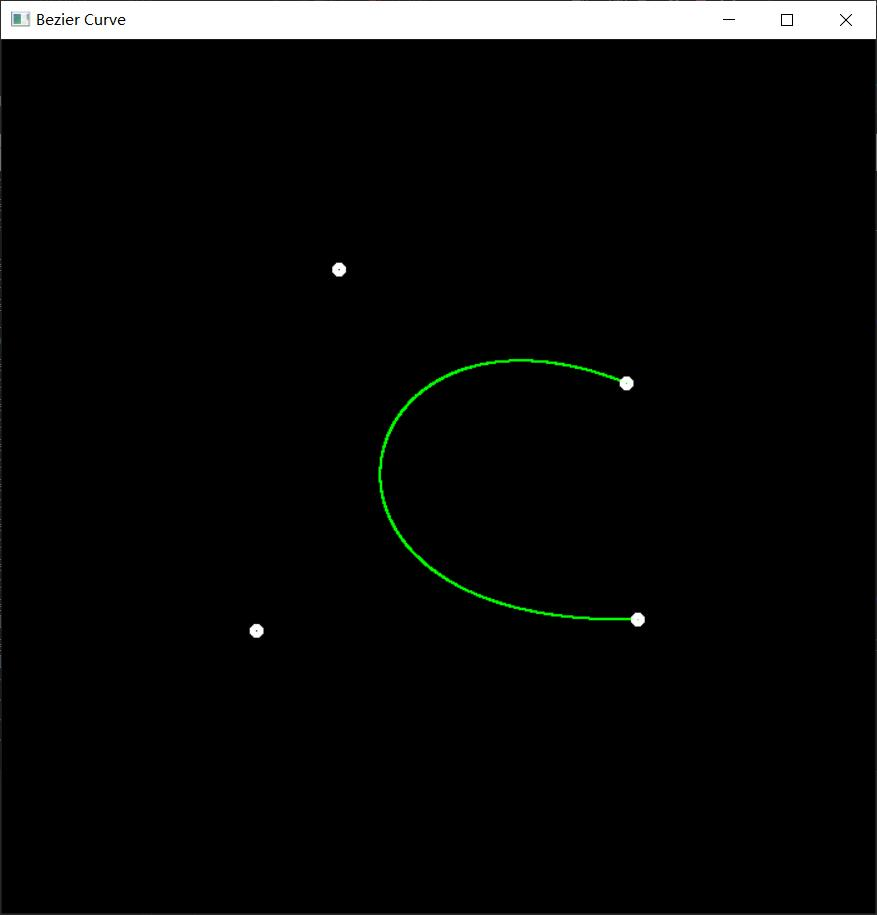
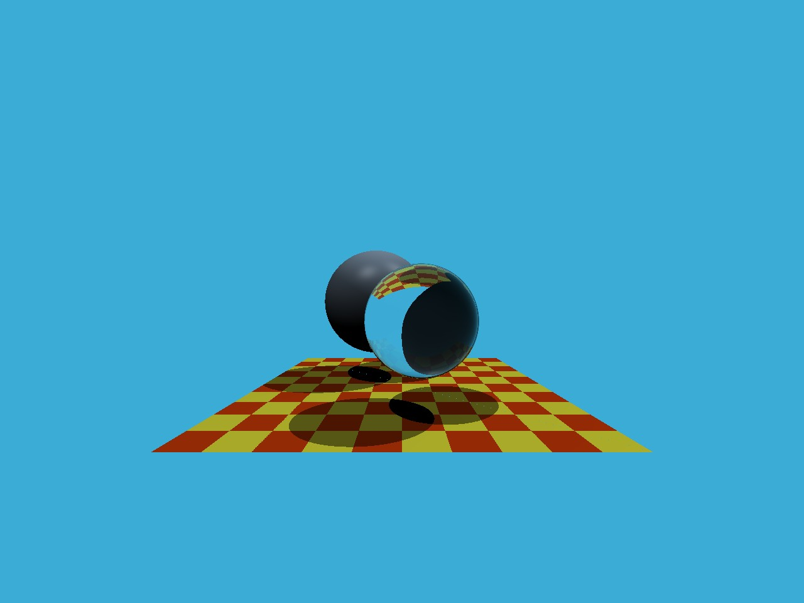
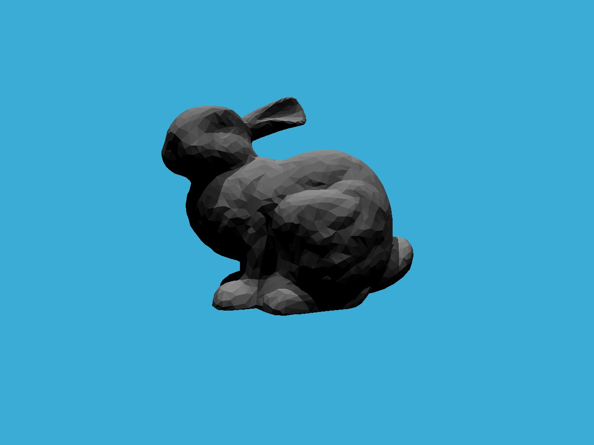

# Games101_hw_show
show Games101 homework
 - 鉴于老师不让发源码，这里就发最终效果了
 - 作业一：MVP矩阵
 

 - 作业二：光栅化和MSAA
 
 
 
  - 作业三：纹理应用
 
 
 
 - 作业四：贝塞尔曲线
 
 
 
 - 作业五：光追
 
 
 
   - 作业六：包围盒算法遍历，AABB，SAH（参考pbrt 
 
 
 
   - 作业七：路径追踪
 
 
 
 - 作业8框架不适合windows就用taichi自己做了一个：弹簧模拟

